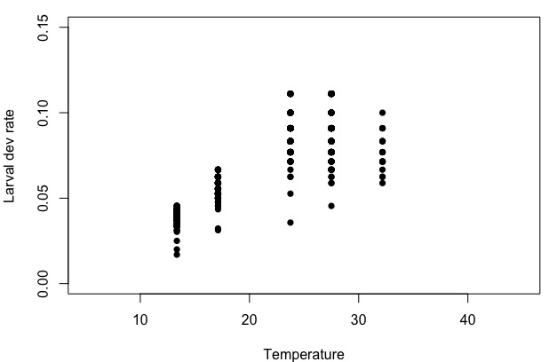
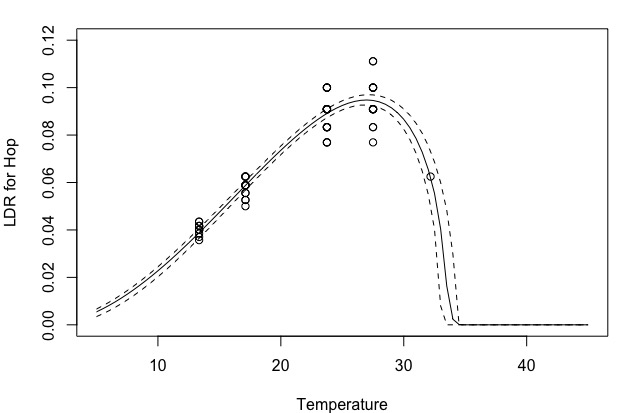
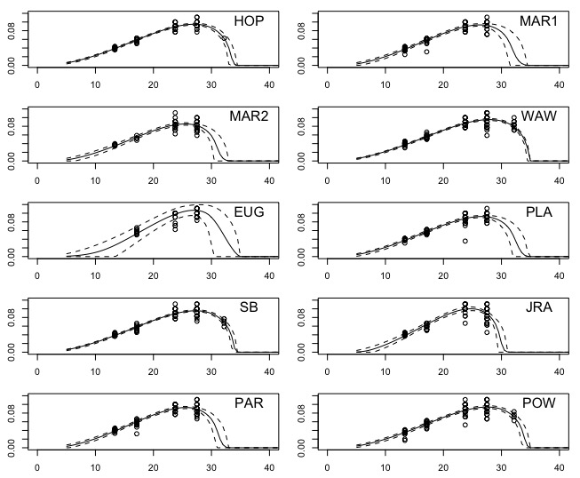
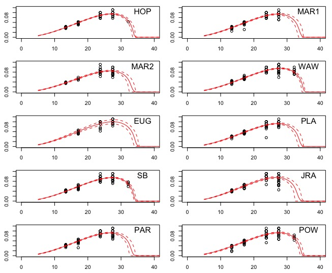
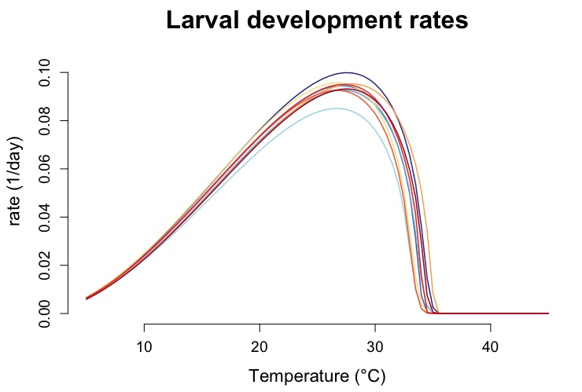
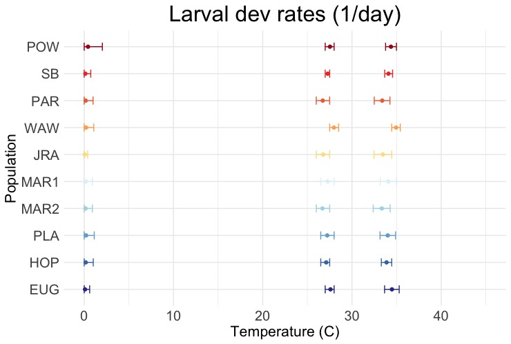

# Tutorial on Bayesian Curve Fitting 

## Overview

In this tutorial, we will go through the steps involved in fitting mosquito thermal response curves using Bayesian methods. Specifically, we will fit temperature response functions to larval mosquito development rate ("LDR") for 10 populations of Aedes sierrensis, the western tree hole mosquito. The basic steps will involve:

1) Loading the data and libraries needed for analysis
2) Plotting the raw data to determine the appropriate functional form to fit
3) Setting up the JAGS model
4) Setting up the MCMC simulation
5) Fitting using low information priors (uniform priors bounded by biologically realistic constraints)
6) Generating informative priors using a leave-one-out approach
7) Fitting using these informative priors
8) Visually checking the model fits
9) Calculating additional thermal performance parameters
10) Plotting thermal response curves and parameter estimates 

The data used in this tutorial can be found [here.](https://github.com/lcouper/AnalysisTutorials/blob/main/BayesianCurveFitting/LifeHistoryTraitExp_TutorialData.csv) 

Note this tutorial builds on code and approaches used by [Shocket et al. 2020](https://elifesciences.org/articles/58511) and [Mordecai et al. 2013](https://onlinelibrary.wiley.com/doi/abs/10.1111/ele.12015)[& 2017](https://journals.plos.org/plosntds/article?id=10.1371/journal.pntd.0005568). For more background on mosquito thermal biology and Bayesian curve fitting, see: [Mordecai et al. 2019. Ecology Letters.](https://onlinelibrary.wiley.com/doi/full/10.1111/ele.13335)

### 1. Loading data and libraries 

```{r setup, include=FALSE, warning = FALSE, message = FALSE}
# Set working directory. (Note: this will differ for you. Just make sure it matches where you downloaded the data)
knitr::opts_knit$set(root.dir = '~/Documents/Current_Projects/LifeHistoryTraitExp/Analysis_TraitFits')
```
```{r}
# Load libraries for fitting traits
library('R2jags')
library('mcmcplots')
library('MASS')
library('HDInterval')

# Load the data and remove any missing values
data.LDR = read.csv("LifeHistoryTraitExp_Data.csv")[,-1]
data.LDR = data.LDR[!is.na(data.LDR$LarvalDevRate),]

# Subset the data by mosquito population. Here, 'population' refers to a single tree hole from which Aedes sierrensis larvae were collected. Populations used here ranged from Southern California to Eugene, Orgeon

data.LDR.HOP <- subset(data.LDR, Population == "HOP")
data.LDR.MAR1 <- subset(data.LDR, Population == "MARIN35")
data.LDR.MAR2 <- subset(data.LDR, Population == "MARIN29")
data.LDR.WAW <- subset(data.LDR, Population == "WAW")
data.LDR.EUG <- subset(data.LDR, Population == "EUG")
data.LDR.PLA <- subset(data.LDR, Population == "PLA")
data.LDR.SB <- subset(data.LDR, Population == "SB")
data.LDR.JRA <- subset(data.LDR, Population == "JRA")
data.LDR.PAR <- subset(data.LDR, Population == "PAR")
data.LDR.POW <- subset(data.LDR, Population == "POW")
```
### 2. Plot raw trait data

```{r}
plot(LarvalDevRate ~ Temp.Treatment, xlim = c(5, 45), ylim = c(0,0.15), pch = 16,
     data = data.LDR, ylab = "Larval dev rate", xlab = "Temperature")
```



The raw experimental data appears left-skewed, which is typical for rate traits of ectotherms such as development, fecundity, and biting. These are well described by Briere functions: 
$$cT(T-T0)\sqrt{Tm−T}$$ 
where T0 and Tm are the critical thermal minimum and maximum, respectively and c is a positive rate constant.

The other commonly used function is the quadratic, which is symmetrical and better describes probability traits such as survival at a given life stage. The quadratic function is given as:
$$-c(T–T0)(T–Tm))$$

### 3. Setting up the JAGS model

Next we set-up the JAGS ('Just Another Gibbs Sampler') model, which we will use to run Bayesian models using simulation.
We are using this approach to estimate T0, Tm, and c (the critical thermal minimum, maximum, and rate constant) shown in the equation above, and predicted trait values, needed to generate continuous thermal response curves.

In the set-up, we: 

1) Specify the priors -- a probability distribution capturing our beliefs about what the parameters may be, using our knowledge of the system. In the first round of model fitting, we are using 'low information' priors. These are uniform priors bounded by biologically realistic temperature constraints. For T0, we set these bounds to be 0-20&deg;C, meaning the probability distribution will only take on values in this range, and all values within this range are equally likely. For Tm, we set the bounds as 28-35&deg;C. These bounds were based on prior experiments and information from other mosquito species. We also specify sigma and tau, which expresses the standard deviation used when making trait predictions.
2) Specify the likelihood function, which defines how the raw data link to the parameters you are trying to estimate. Here, we use the Briere function from above, and set trait performance to 0 if  T0 > T > Tm.
3) Specify any additional quantities we want the model to estimate, which for us are the predicted trait values across a sequence of temperatures. This will enable us to generate a continuous thermal performance curve from experimental trait data measured at 6 temperatures.

```{r, results = 'hide'}
{
  sink("briere.txt") # This drives the text below to a text file, which will be saved in your working directory
cat("
    model{  
    
    # 1. Specify the Priors
    cf.q ~ dunif(0, 1) # c = a positive rate constant
    cf.T0 ~ dunif(0, 20) 
    cf.Tm ~ dunif(28, 35) # 35 set based on prior experiments on larval survival
    cf.sigma ~ dunif(0, 1000) # standard deviation 
    cf.tau <- 1 / (cf.sigma * cf.sigma)
    
    # 2. Specify the Likelihood function (here, Briere. Note the last two terms are to set performance to 0 if Tm < T < T0)
    for(i in 1:N.obs){
    trait.mu[i] <- cf.q * temp[i] * (temp[i] - cf.T0) * sqrt((cf.Tm - temp[i]) * (cf.Tm > temp[i])) * (cf.T0 < temp[i])
    trait[i] ~ dnorm(trait.mu[i], cf.tau) # trait values drawn from normal dist with variance from ct tau
    }
    
    # 3. Specify the Derived Quantities and Predictions
    for(i in 1:N.Temp.xs){
    z.trait.mu.pred[i] <- cf.q * Temp.xs[i] * (Temp.xs[i] - cf.T0) * sqrt((cf.Tm - Temp.xs[i]) * (cf.Tm > Temp.xs[i])) * (cf.T0 < Temp.xs[i])
    }
    
    } # close model
    ",fill=T)
sink()
}
```

### 4. Setting up the MCMC simulation

Next we set-up the Markov Chain Monte Carlo sampler. This is a way to *approximate* the posterior distribution when you can't solve for it analytically (i.e., because the shape of the prior and likelihood distributions are funky and can't be easily combined). The way the simulation works is it start with some initial parameter value, for example '32&deg;C' for Tm. Then it picks another random parameter value, compares it with the previous one, and keeps whichever has the *higher likelihood* of being in the posterior distribution. This value gets added to the 'chain', and the process is repeated for as many iterations as you specify. Eventually your chain will converge on a single parameter value. We 'burn-in', or drop from the chain, some number of initial entries in the chain, as these are more heavily influenced by our choice of initial value, which we don't want. We can also 'thin' our chain by saving every nth iteration in the chain. This can help reduce the autocorrelation of points in the chain, since each point depends on the prior point. You can also repeat this process several times (i.e., build multiple chains), which will help with model convergence and enable more precise parameter estimates.

```{r, results = 'hide'}
# For each parameter, we specify the initial values to use in the MCMC simulation
inits<-function(){list(
  cf.q = 0.01,
  cf.Tm = 35,
  cf.T0 = 5,
  cf.sigma = rlnorm(1))}

# Parameters to Estimate 
parameters <- c("cf.q", "cf.T0", "cf.Tm","cf.sigma", "z.trait.mu.pred")

# Specify the MCMC settings 
ni <- 25000 # number of iterations in each chain
nb <- 5000 # number of 'burn in' iterations to discard
nt <- 8 # thinning rate - save every nth iteration in each chain
nc <- 3 # number of chains

# Temperature sequence for derived quantity calculations
# This enables us to build the continuous thermal performance curve
Temp.xs <- seq(1, 45, 0.1)
N.Temp.xs <-length(Temp.xs)
# For priors - fewer temperatures for derived calculations makes it go faster
Temp.xs <- seq(5, 45, 0.5)
N.Temp.xs <-length(Temp.xs)
```
## 5. For each population, fit the model using low information priors
```{r, warning = FALSE, results = 'hide'}
# Below, we fit the model for a single population -- Hopland, or 'HOP'

# We first organize the data for the JAGS model
data <- data.LDR.HOP
trait <- data$LarvalDevRate
N.obs <- length(trait)
temp <- data$Temp.Treatment
jag.data<-list(trait = trait, N.obs = N.obs, temp = temp, Temp.xs = Temp.xs, N.Temp.xs = N.Temp.xs)

# Then we run the JAGS model
LDR.HOP.out <- jags(data=jag.data, inits=inits, parameters.to.save=parameters, model.file="briere.txt",
                          n.thin=nt, n.chains=nc, n.burnin=nb, n.iter=ni, DIC=T, working.directory=getwd())
```
#### Now we can examine the output...

The output summary shows the mean, standard deviation, and quartiles for each of the specified parameters.
You can also view values from each iteration of the chain and model diagnostics
```{r, warning = FALSE}
LDR.HOP.out$BUGSoutput$summary[1:5,]
# View (LDR.HOP.out$BUGSoutput) # To look at values from each iteration
# mcmcplot(LDR.HOP.prior.out) # To view model diagnostic plots (e.g., convergence, autocorrelation)
```

#### ...and plot the raw data with the model fits. Here we're plotting the mean, 2.5%, and 97.5% quantiles for the predicted trait values across temperature
```{r, fig = TRUE}
plot(LarvalDevRate ~ Temp.Treatment, xlim = c(5, 45), ylim = c(0,0.12), data = data.LDR.HOP, ylab = "LDR for Hop", xlab = "Temperature")
lines(LDR.HOP.out$BUGSoutput$summary[6:(6 + N.Temp.xs - 1), "mean"] ~ Temp.xs)
lines(LDR.HOP.out$BUGSoutput$summary[6:(6 + N.Temp.xs - 1), "2.5%"] ~ Temp.xs, lty = 2)
lines(LDR.HOP.out$BUGSoutput$summary[6:(6 + N.Temp.xs - 1), "97.5%"] ~ Temp.xs, lty = 2)
```


The model fit appears to describe the raw data well for this trait and population.

The above code (starting from "data <- data.LDR.HOP") was just for the 'HOP' population. Try modifying the code to repeat the process for the nine remaining populations: MAR1, MAR2, WAW, EUG, PLA, SB, JRA, PAR, and POW. (Below is the code to do so, if needed)

```{r, warning = FALSE, results = 'hide'}
# MAR1
data <- data.LDR.MAR1 
trait <- data$LarvalDevRate
N.obs <- length(trait)
temp <- data$Temp.Treatment
jag.data<-list(trait = trait, N.obs = N.obs, temp = temp, Temp.xs = Temp.xs, N.Temp.xs = N.Temp.xs)
LDR.MAR1.out <- jags(data=jag.data, inits=inits, parameters.to.save=parameters, model.file="briere.txt",
                     n.thin=nt, n.chains=nc, n.burnin=nb, n.iter=ni, DIC=T, working.directory=getwd())

# MAR2
data <- data.LDR.MAR2 
trait <- data$LarvalDevRate
N.obs <- length(trait)
temp <- data$Temp.Treatment
jag.data<-list(trait = trait, N.obs = N.obs, temp = temp, Temp.xs = Temp.xs, N.Temp.xs = N.Temp.xs)
LDR.MAR2.out <- jags(data=jag.data, inits=inits, parameters.to.save=parameters, model.file="briere.txt",
                     n.thin=nt, n.chains=nc, n.burnin=nb, n.iter=ni, DIC=T, working.directory=getwd())

# WAW
data <- data.LDR.WAW 
trait <- data$LarvalDevRate
N.obs <- length(trait)
temp <- data$Temp.Treatment
jag.data<-list(trait = trait, N.obs = N.obs, temp = temp, Temp.xs = Temp.xs, N.Temp.xs = N.Temp.xs)
LDR.WAW.out <- jags(data=jag.data, inits=inits, parameters.to.save=parameters, model.file="briere.txt",
                    n.thin=nt, n.chains=nc, n.burnin=nb, n.iter=ni, DIC=T, working.directory=getwd())

# EUG
data <- data.LDR.EUG 
trait <- data$LarvalDevRate
N.obs <- length(trait)
temp <- data$Temp.Treatment
jag.data<-list(trait = trait, N.obs = N.obs, temp = temp, Temp.xs = Temp.xs, N.Temp.xs = N.Temp.xs)
LDR.EUG.out <- jags(data=jag.data, inits=inits, parameters.to.save=parameters, model.file="briere.txt",
                    n.thin=nt, n.chains=nc, n.burnin=nb, n.iter=ni, DIC=T, working.directory=getwd())

# PLA
data <- data.LDR.PLA 
trait <- data$LarvalDevRate
N.obs <- length(trait)
temp <- data$Temp.Treatment
jag.data<-list(trait = trait, N.obs = N.obs, temp = temp, Temp.xs = Temp.xs, N.Temp.xs = N.Temp.xs)
LDR.PLA.out <- jags(data=jag.data, inits=inits, parameters.to.save=parameters, model.file="briere.txt",
                    n.thin=nt, n.chains=nc, n.burnin=nb, n.iter=ni, DIC=T, working.directory=getwd())

# SB
trait <- data$LarvalDevRate
N.obs <- length(trait)
temp <- data$Temp.Treatment
jag.data<-list(trait = trait, N.obs = N.obs, temp = temp, Temp.xs = Temp.xs, N.Temp.xs = N.Temp.xs)
LDR.SB.out <- jags(data=jag.data, inits=inits, parameters.to.save=parameters, model.file="briere.txt",
                   n.thin=nt, n.chains=nc, n.burnin=nb, n.iter=ni, DIC=T, working.directory=getwd())

# JRA
data <- data.LDR.JRA 
trait <- data$LarvalDevRate
N.obs <- length(trait)
temp <- data$Temp.Treatment
jag.data<-list(trait = trait, N.obs = N.obs, temp = temp, Temp.xs = Temp.xs, N.Temp.xs = N.Temp.xs)
LDR.JRA.out <- jags(data=jag.data, inits=inits, parameters.to.save=parameters, model.file="briere.txt",
                    n.thin=nt, n.chains=nc, n.burnin=nb, n.iter=ni, DIC=T, working.directory=getwd())

# PAR 
trait <- data$LarvalDevRate
N.obs <- length(trait)
temp <- data$Temp.Treatment
jag.data<-list(trait = trait, N.obs = N.obs, temp = temp, Temp.xs = Temp.xs, N.Temp.xs = N.Temp.xs)
LDR.PAR.out <- jags(data=jag.data, inits=inits, parameters.to.save=parameters, model.file="briere.txt",
                    n.thin=nt, n.chains=nc, n.burnin=nb, n.iter=ni, DIC=T, working.directory=getwd())

# POW 
data <- data.LDR.POW 
trait <- data$LarvalDevRate
N.obs <- length(trait)
temp <- data$Temp.Treatment
jag.data<-list(trait = trait, N.obs = N.obs, temp = temp, Temp.xs = Temp.xs, N.Temp.xs = N.Temp.xs)
LDR.POW.out <- jags(data=jag.data, inits=inits, parameters.to.save=parameters, model.file="briere.txt",
                    n.thin=nt, n.chains=nc, n.burnin=nb, n.iter=ni, DIC=T, working.directory=getwd())
```

Lets visually check the fits for each population by plotting the raw data and model fits.



## 6. Generating informative priors using leave-one-out 
The model fits shown in the plots above are quite good, but we can obtain more precise parameter estimates and thermal responses by using informative priors. Here, we'll generate informative priors using a 'leave-one-out' approach. For each population, our prior distributions will be based on the parameter estimates generating using low information priors for *the nine other populations*. 

First we subset the data, so that each subset excludes one population.

```{r, warning = FALSE}
data.LDR.HOP.prior <- subset(data.LDR, Population != "HOP")
data.LDR.MAR1.prior <- subset(data.LDR, Population != "MARIN35")
data.LDR.MAR2.prior <- subset(data.LDR, Population != "MARIN29")
data.LDR.WAW.prior <- subset(data.LDR, Population != "WAW")
data.LDR.EUG.prior <- subset(data.LDR, Population != "EUG")
data.LDR.PLA.prior <- subset(data.LDR, Population != "PLA")
data.LDR.SB.prior <- subset(data.LDR, Population != "SB")
data.LDR.JRA.prior <- subset(data.LDR, Population != "JRA")
data.LDR.PAR.prior <- subset(data.LDR, Population != "PAR")
data.LDR.POW.prior <- subset(data.LDR, Population != "POW")
```
Next we run the model fitting procedure as in step 5, using the same JAGS and MCMC settings, and save the output for later use.

```{r, warning = FALSE}
# HOP
data <- data.LDR.HOP.prior
trait <- data$LarvalDevRate
N.obs <- length(trait)
temp <- data$Temp.Treatment
jag.data<-list(trait = trait, N.obs = N.obs, temp = temp, Temp.xs = Temp.xs, N.Temp.xs = N.Temp.xs)
LDR.HOP.prior.out <- jags(data=jag.data, inits=inits, parameters.to.save=parameters, model.file="briere.txt",
                          n.thin=nt, n.chains=nc, n.burnin=nb, n.iter=ni, DIC=T, working.directory=getwd())

# MAR1
data <- data.LDR.MAR1.prior
trait <- data$LarvalDevRate
N.obs <- length(trait)
temp <- data$Temp.Treatment
jag.data<-list(trait = trait, N.obs = N.obs, temp = temp, Temp.xs = Temp.xs, N.Temp.xs = N.Temp.xs)
LDR.MAR1.prior.out <- jags(data=jag.data, inits=inits, parameters.to.save=parameters, model.file="briere.txt",
                           n.thin=nt, n.chains=nc, n.burnin=nb, n.iter=ni, DIC=T, working.directory=getwd())

# MAR2
data <- data.LDR.MAR2.prior
trait <- data$LarvalDevRate
N.obs <- length(trait)
temp <- data$Temp.Treatment
jag.data<-list(trait = trait, N.obs = N.obs, temp = temp, Temp.xs = Temp.xs, N.Temp.xs = N.Temp.xs)
LDR.MAR2.prior.out <- jags(data=jag.data, inits=inits, parameters.to.save=parameters, model.file="briere.txt",
                           n.thin=nt, n.chains=nc, n.burnin=nb, n.iter=ni, DIC=T, working.directory=getwd())

# WAW
data <- data.LDR.WAW.prior
trait <- data$LarvalDevRate
N.obs <- length(trait)
temp <- data$Temp.Treatment
jag.data<-list(trait = trait, N.obs = N.obs, temp = temp, Temp.xs = Temp.xs, N.Temp.xs = N.Temp.xs)
LDR.WAW.prior.out <- jags(data=jag.data, inits=inits, parameters.to.save=parameters, model.file="briere.txt",
                          n.thin=nt, n.chains=nc, n.burnin=nb, n.iter=ni, DIC=T, working.directory=getwd())

# EUG
data <- data.LDR.EUG.prior
trait <- data$LarvalDevRate
N.obs <- length(trait)
temp <- data$Temp.Treatment
jag.data<-list(trait = trait, N.obs = N.obs, temp = temp, Temp.xs = Temp.xs, N.Temp.xs = N.Temp.xs)
LDR.EUG.prior.out <- jags(data=jag.data, inits=inits, parameters.to.save=parameters, model.file="briere.txt",
                          n.thin=nt, n.chains=nc, n.burnin=nb, n.iter=ni, DIC=T, working.directory=getwd())

# PLA
data <- data.LDR.PLA.prior
trait <- data$LarvalDevRate
N.obs <- length(trait)
temp <- data$Temp.Treatment
jag.data<-list(trait = trait, N.obs = N.obs, temp = temp, Temp.xs = Temp.xs, N.Temp.xs = N.Temp.xs)
LDR.PLA.prior.out <- jags(data=jag.data, inits=inits, parameters.to.save=parameters, model.file="briere.txt",
                          n.thin=nt, n.chains=nc, n.burnin=nb, n.iter=ni, DIC=T, working.directory=getwd())

# SB
data <- data.LDR.SB.prior
trait <- data$LarvalDevRate
N.obs <- length(trait)
temp <- data$Temp.Treatment
jag.data<-list(trait = trait, N.obs = N.obs, temp = temp, Temp.xs = Temp.xs, N.Temp.xs = N.Temp.xs)
LDR.SB.prior.out <- jags(data=jag.data, inits=inits, parameters.to.save=parameters, model.file="briere.txt",
                         n.thin=nt, n.chains=nc, n.burnin=nb, n.iter=ni, DIC=T, working.directory=getwd())

# JRA
data <- data.LDR.JRA.prior
trait <- data$LarvalDevRate
N.obs <- length(trait)
temp <- data$Temp.Treatment
jag.data<-list(trait = trait, N.obs = N.obs, temp = temp, Temp.xs = Temp.xs, N.Temp.xs = N.Temp.xs)
LDR.JRA.prior.out <- jags(data=jag.data, inits=inits, parameters.to.save=parameters, model.file="briere.txt",
                          n.thin=nt, n.chains=nc, n.burnin=nb, n.iter=ni, DIC=T, working.directory=getwd())

# PAR
data <- data.LDR.PAR.prior
trait <- data$LarvalDevRate
N.obs <- length(trait)
temp <- data$Temp.Treatment
jag.data<-list(trait = trait, N.obs = N.obs, temp = temp, Temp.xs = Temp.xs, N.Temp.xs = N.Temp.xs)
LDR.PAR.prior.out <- jags(data=jag.data, inits=inits, parameters.to.save=parameters, model.file="briere.txt",
                          n.thin=nt, n.chains=nc, n.burnin=nb, n.iter=ni, DIC=T, working.directory=getwd())

# POW
data <- data.LDR.POW.prior
trait <- data$LarvalDevRate
N.obs <- length(trait)
temp <- data$Temp.Treatment
jag.data<-list(trait = trait, N.obs = N.obs, temp = temp, Temp.xs = Temp.xs, N.Temp.xs = N.Temp.xs)
LDR.POW.prior.out <- jags(data=jag.data, inits=inits, parameters.to.save=parameters, model.file="briere.txt",
                          n.thin=nt, n.chains=nc, n.burnin=nb, n.iter=ni, DIC=T, working.directory=getwd())
```
Now we'll save the posterior distributions of these parameters to use as our informative priors in the next step

```{r, warning = FALSE}

LDR.HOP.prior.cf.dists <- data.frame(q = as.vector(LDR.HOP.prior.out$BUGSoutput$sims.list$cf.q),
                                     T0 = as.vector(LDR.HOP.prior.out$BUGSoutput$sims.list$cf.T0), 
                                     Tm = as.vector(LDR.HOP.prior.out$BUGSoutput$sims.list$cf.Tm))
LDR.HOP.prior.gamma.fits = apply(LDR.HOP.prior.cf.dists, 2, function(df) fitdistr(df, "gamma")$estimate)

LDR.MAR1.prior.cf.dists <- data.frame(q = as.vector(LDR.MAR1.prior.out$BUGSoutput$sims.list$cf.q),
                                      T0 = as.vector(LDR.MAR1.prior.out$BUGSoutput$sims.list$cf.T0), 
                                      Tm = as.vector(LDR.MAR1.prior.out$BUGSoutput$sims.list$cf.Tm))
LDR.MAR1.prior.gamma.fits = apply(LDR.MAR1.prior.cf.dists, 2, function(df) fitdistr(df, "gamma")$estimate)

LDR.MAR2.prior.cf.dists <- data.frame(q = as.vector(LDR.MAR2.prior.out$BUGSoutput$sims.list$cf.q),
                                      T0 = as.vector(LDR.MAR2.prior.out$BUGSoutput$sims.list$cf.T0), 
                                      Tm = as.vector(LDR.MAR2.prior.out$BUGSoutput$sims.list$cf.Tm))
LDR.MAR2.prior.gamma.fits = apply(LDR.MAR2.prior.cf.dists, 2, function(df) fitdistr(df, "gamma")$estimate)

LDR.WAW.prior.cf.dists <- data.frame(q = as.vector(LDR.WAW.prior.out$BUGSoutput$sims.list$cf.q),
                                     T0 = as.vector(LDR.WAW.prior.out$BUGSoutput$sims.list$cf.T0), 
                                     Tm = as.vector(LDR.WAW.prior.out$BUGSoutput$sims.list$cf.Tm))
LDR.WAW.prior.gamma.fits = apply(LDR.WAW.prior.cf.dists, 2, function(df) fitdistr(df, "gamma")$estimate)

LDR.EUG.prior.cf.dists <- data.frame(q = as.vector(LDR.EUG.prior.out$BUGSoutput$sims.list$cf.q),
                                     T0 = as.vector(LDR.EUG.prior.out$BUGSoutput$sims.list$cf.T0), 
                                     Tm = as.vector(LDR.EUG.prior.out$BUGSoutput$sims.list$cf.Tm))
LDR.EUG.prior.gamma.fits = apply(LDR.EUG.prior.cf.dists, 2, function(df) fitdistr(df, "gamma")$estimate)

LDR.PLA.prior.cf.dists <- data.frame(q = as.vector(LDR.PLA.prior.out$BUGSoutput$sims.list$cf.q),
                                     T0 = as.vector(LDR.PLA.prior.out$BUGSoutput$sims.list$cf.T0), 
                                     Tm = as.vector(LDR.PLA.prior.out$BUGSoutput$sims.list$cf.Tm))
LDR.PLA.prior.gamma.fits = apply(LDR.PLA.prior.cf.dists, 2, function(df) fitdistr(df, "gamma")$estimate)

LDR.SB.prior.cf.dists <- data.frame(q = as.vector(LDR.SB.prior.out$BUGSoutput$sims.list$cf.q),
                                    T0 = as.vector(LDR.SB.prior.out$BUGSoutput$sims.list$cf.T0), 
                                    Tm = as.vector(LDR.SB.prior.out$BUGSoutput$sims.list$cf.Tm))
LDR.SB.prior.gamma.fits = apply(LDR.SB.prior.cf.dists, 2, function(df) fitdistr(df, "gamma")$estimate)

LDR.JRA.prior.cf.dists <- data.frame(q = as.vector(LDR.JRA.prior.out$BUGSoutput$sims.list$cf.q),
                                     T0 = as.vector(LDR.JRA.prior.out$BUGSoutput$sims.list$cf.T0), 
                                     Tm = as.vector(LDR.JRA.prior.out$BUGSoutput$sims.list$cf.Tm))
LDR.JRA.prior.gamma.fits = apply(LDR.JRA.prior.cf.dists, 2, function(df) fitdistr(df, "gamma")$estimate)

LDR.PAR.prior.cf.dists <- data.frame(q = as.vector(LDR.PAR.prior.out$BUGSoutput$sims.list$cf.q),
                                     T0 = as.vector(LDR.PAR.prior.out$BUGSoutput$sims.list$cf.T0), 
                                     Tm = as.vector(LDR.PAR.prior.out$BUGSoutput$sims.list$cf.Tm))
LDR.PAR.prior.gamma.fits = apply(LDR.PAR.prior.cf.dists, 2, function(df) fitdistr(df, "gamma")$estimate)

LDR.POW.prior.cf.dists <- data.frame(q = as.vector(LDR.POW.prior.out$BUGSoutput$sims.list$cf.q),
                                     T0 = as.vector(LDR.POW.prior.out$BUGSoutput$sims.list$cf.T0), 
                                     Tm = as.vector(LDR.POW.prior.out$BUGSoutput$sims.list$cf.Tm))
LDR.POW.prior.gamma.fits = apply(LDR.POW.prior.cf.dists, 2, function(df) fitdistr(df, "gamma")$estimate)

LDR.hypers <- list(LDR.HOP.prior.gamma.fits, LDR.MAR1.prior.gamma.fits, LDR.MAR2.prior.gamma.fits,
                   LDR.WAW.prior.gamma.fits, LDR.EUG.prior.gamma.fits, LDR.PLA.prior.gamma.fits,
                   LDR.SB.prior.gamma.fits, LDR.JRA.prior.gamma.fits, LDR.PAR.prior.gamma.fits, LDR.POW.prior.gamma.fits)
save(LDR.hypers, file = "~/Documents/Current_Projects/LifeHistoryTraitExp/Analysis_TraitFits/LDRhypers.Rsave")
```

## 7. Fitting using informative priors 
We'll now use the informative priors  generated above and repeat the model fitting procedure for each population. Specifically, we'll fit a gamma distribution to the posterior distribution of each parameter (T0, Tm, c) for each of the leave-one-out groups. We will use this gamma distribution as our priors in this step. We can adjust the 'weighting' of these priors based on the model fits. That is, if the priors appear to be too strongly affecting the shape of the curve and don't match the raw data well, we can down weight the priors, which essentially increases their variance and reduces their effect on the posterior distribution.
Before getting to this, we must first update the JAGS file specifying our gamma-distributed informative priors. 

```{r, results = 'hide'}
{ setwd("~/Documents/Current_Projects/LifeHistoryTraitExp/Analysis_TraitFits")
sink("briere_inf.txt")
cat("
    model{
    
    # 1. Specify the informative priors as gamma distributed
    cf.q ~ dgamma(hypers[1,1], hypers[2,1]) 
    cf.T0 ~ dgamma(hypers[1,2], hypers[2,2])
    cf.Tm ~ dgamma(hypers[1,3], hypers[2,3])
    cf.sigma ~ dunif(0, 1000)
    cf.tau <- 1 / (cf.sigma * cf.sigma)
    
    # 2. Specify the Likelihood function (here, Briere)
    for(i in 1:N.obs){
    trait.mu[i] <- cf.q * temp[i] * (temp[i] - cf.T0) * sqrt((cf.Tm - temp[i]) * (cf.Tm > temp[i])) * (cf.T0 < temp[i])
    trait[i] ~ dnorm(trait.mu[i], cf.tau)
    }
    
    # 3. Specify the Derived Quantities and Predictions
    for(i in 1:N.Temp.xs){
    z.trait.mu.pred[i] <- cf.q * Temp.xs[i] * (Temp.xs[i] - cf.T0) * sqrt((cf.Tm - Temp.xs[i]) * (cf.Tm > Temp.xs[i])) * (cf.T0 < Temp.xs[i])
    }
    
    } # close model
    ",fill=T)
sink()
}
```

Now we'll load the informative priors...

```{r, warning = FALSE}
# To bypass the above code where we generated the informative priors, you can load the saved hyperparameters:
load("LDRhypers.Rsave")
LDR.HOP.prior.gamma.fits <- LDR.hypers[[1]]
LDR.MAR1.prior.gamma.fits <- LDR.hypers[[2]]
LDR.MAR2.prior.gamma.fits <- LDR.hypers[[3]]
LDR.WAW.prior.gamma.fits <- LDR.hypers[[4]]
LDR.EUG.prior.gamma.fits <- LDR.hypers[[5]]
LDR.PLA.prior.gamma.fits <- LDR.hypers[[6]]
LDR.SB.prior.gamma.fits <- LDR.hypers[[7]]
LDR.JRA.prior.gamma.fits <- LDR.hypers[[8]]
LDR.PAR.prior.gamma.fits <- LDR.hypers[[9]]
LDR.POW.prior.gamma.fits <- LDR.hypers[[10]]
```

... and perform the model fitting procedure for each population

```{r, warning = FALSE}
# HOP
data <- data.LDR.HOP
hypers <- LDR.HOP.prior.gamma.fits * 0.1 # Note this is where you can adjust the weight of the priors. Decreasing this value (e.g., to '0.01' will increase the variance of the priors and reduce their effect on the posterior distribution)
trait <- data$LarvalDevRate
N.obs <- length(trait)
temp <- data$Temp.Treatment
jag.data <- list(trait = trait, N.obs = N.obs, temp = temp, Temp.xs = Temp.xs, N.Temp.xs = N.Temp.xs, hypers = hypers)
LDR.HOP.out.inf <- jags(data=jag.data, inits=inits, parameters.to.save=parameters, model.file="briere_inf.txt",
                        n.thin=nt, n.chains=nc, n.burnin=nb, n.iter=ni, DIC=T, working.directory=getwd())

# MAR1
data <- data.LDR.MAR1
hypers <- LDR.MAR1.prior.gamma.fits * 0.1
trait <- data$LarvalDevRate
N.obs <- length(trait)
temp <- data$Temp.Treatment
jag.data <- list(trait = trait, N.obs = N.obs, temp = temp, Temp.xs = Temp.xs, N.Temp.xs = N.Temp.xs, hypers = hypers)
LDR.MAR1.out.inf <- jags(data=jag.data, inits=inits, parameters.to.save=parameters, model.file="briere_inf.txt",
                         n.thin=nt, n.chains=nc, n.burnin=nb, n.iter=ni, DIC=T, working.directory=getwd())

# MAR2
data <- data.LDR.MAR2
hypers <- LDR.MAR2.prior.gamma.fits * 0.1
trait <- data$LarvalDevRate
N.obs <- length(trait)
temp <- data$Temp.Treatment
jag.data <- list(trait = trait, N.obs = N.obs, temp = temp, Temp.xs = Temp.xs, N.Temp.xs = N.Temp.xs, hypers = hypers)
LDR.MAR2.out.inf <- jags(data=jag.data, inits=inits, parameters.to.save=parameters, model.file="briere_inf.txt",
                         n.thin=nt, n.chains=nc, n.burnin=nb, n.iter=ni, DIC=T, working.directory=getwd())

# WAW
data <- data.LDR.WAW
hypers <- LDR.WAW.prior.gamma.fits * 0.1
trait <- data$LarvalDevRate
N.obs <- length(trait)
temp <- data$Temp.Treatment
jag.data <- list(trait = trait, N.obs = N.obs, temp = temp, Temp.xs = Temp.xs, N.Temp.xs = N.Temp.xs, hypers = hypers)
LDR.WAW.out.inf <- jags(data=jag.data, inits=inits, parameters.to.save=parameters, model.file="briere_inf.txt",
                        n.thin=nt, n.chains=nc, n.burnin=nb, n.iter=ni, DIC=T, working.directory=getwd())

# EUG
data <- data.LDR.EUG
hypers <- LDR.EUG.prior.gamma.fits * 0.1
trait <- data$LarvalDevRate
N.obs <- length(trait)
temp <- data$Temp.Treatment
jag.data <- list(trait = trait, N.obs = N.obs, temp = temp, Temp.xs = Temp.xs, N.Temp.xs = N.Temp.xs, hypers = hypers)
LDR.EUG.out.inf <- jags(data=jag.data, inits=inits, parameters.to.save=parameters, model.file="briere_inf.txt",
                        n.thin=nt, n.chains=nc, n.burnin=nb, n.iter=ni, DIC=T, working.directory=getwd())

# PLA
data <- data.LDR.PLA
hypers <- LDR.PLA.prior.gamma.fits * 0.1
trait <- data$LarvalDevRate
N.obs <- length(trait)
temp <- data$Temp.Treatment
jag.data <- list(trait = trait, N.obs = N.obs, temp = temp, Temp.xs = Temp.xs, N.Temp.xs = N.Temp.xs, hypers = hypers)
LDR.PLA.out.inf <- jags(data=jag.data, inits=inits, parameters.to.save=parameters, model.file="briere_inf.txt",
                        n.thin=nt, n.chains=nc, n.burnin=nb, n.iter=ni, DIC=T, working.directory=getwd())

# SB
data <- data.LDR.SB
hypers <- LDR.SB.prior.gamma.fits * 0.1
trait <- data$LarvalDevRate
N.obs <- length(trait)
temp <- data$Temp.Treatment
jag.data <- list(trait = trait, N.obs = N.obs, temp = temp, Temp.xs = Temp.xs, N.Temp.xs = N.Temp.xs, hypers = hypers)
LDR.SB.out.inf <- jags(data=jag.data, inits=inits, parameters.to.save=parameters, model.file="briere_inf.txt",
                       n.thin=nt, n.chains=nc, n.burnin=nb, n.iter=ni, DIC=T, working.directory=getwd())

# JRA
data <- data.LDR.JRA
hypers <- LDR.JRA.prior.gamma.fits * 0.1
trait <- data$LarvalDevRate
N.obs <- length(trait)
temp <- data$Temp.Treatment
jag.data <- list(trait = trait, N.obs = N.obs, temp = temp, Temp.xs = Temp.xs, N.Temp.xs = N.Temp.xs, hypers = hypers)
LDR.JRA.out.inf <- jags(data=jag.data, inits=inits, parameters.to.save=parameters, model.file="briere_inf.txt",
                        n.thin=nt, n.chains=nc, n.burnin=nb, n.iter=ni, DIC=T, working.directory=getwd())

# PAR
data <- data.LDR.PAR
hypers <- LDR.PAR.prior.gamma.fits * 0.1
trait <- data$LarvalDevRate
N.obs <- length(trait)
temp <- data$Temp.Treatment
jag.data <- list(trait = trait, N.obs = N.obs, temp = temp, Temp.xs = Temp.xs, N.Temp.xs = N.Temp.xs, hypers = hypers)
LDR.PAR.out.inf <- jags(data=jag.data, inits=inits, parameters.to.save=parameters, model.file="briere_inf.txt",
                        n.thin=nt, n.chains=nc, n.burnin=nb, n.iter=ni, DIC=T, working.directory=getwd())

# POW
data <- data.LDR.POW
hypers <- LDR.POW.prior.gamma.fits * 0.1
trait <- data$LarvalDevRate
N.obs <- length(trait)
temp <- data$Temp.Treatment
jag.data <- list(trait = trait, N.obs = N.obs, temp = temp, Temp.xs = Temp.xs, N.Temp.xs = N.Temp.xs, hypers = hypers)
LDR.POW.out.inf <- jags(data=jag.data, inits=inits, parameters.to.save=parameters, model.file="briere_inf.txt",
                        n.thin=nt, n.chains=nc, n.burnin=nb, n.iter=ni, DIC=T, working.directory=getwd())
```

## 8. Checking model fits 
As before, lets check the model fits for each population by plotting the raw data along with the mean, 2.5% and 97.5% quantiles for the predicted trait values at each temperature



The model appears to fit the data well for each population. 

## 9. Calculating additional thermal performance characteristics

We have obtained estimates for T0 and Tm. But we may also be interested in Topt (the temperature at max trait performance), Pmax (the max trait performance), and Tbreadth (the range at which trait values are >= 50% of the max). Below we will define functions to calculate each of these parameters. Note that you could follow a similar procedure to characterize other features of the thermal response.

```{r, warning = FALSE}
# Function to calculate Topt of LDR for each population

Topt = function(x) {
  Matrix = x[["BUGSoutput"]][["sims.matrix"]]
  ToptVec = rep(NA, nrow(Matrix))
  for (i in 1:nrow(Matrix))
  {ToptVec[i] = Temp.xs[which.max(Matrix[i,6:86])]}
  return(c(mean(ToptVec), quantile(ToptVec, c(0.025, 0.975))))
}

# Function to calculate Pmax of LDR for each population ######

Pmax = function(x) {
  Matrix = x[["BUGSoutput"]][["sims.matrix"]]
  PmaxVec = rep(NA, nrow(Matrix))
  for (i in 1:nrow(Matrix))
  {PmaxVec[i] = max(Matrix[i,6:86])}
  return(c(mean(PmaxVec), quantile(PmaxVec, c(0.025, 0.975))))
}

# Function to calculate Tbreadth for each population #####

# Tbreadth defined as the temperature range where 
# performance remains >= 50% peak performance

Tbreadth = function(x) {
  Matrix = x[["BUGSoutput"]][["sims.matrix"]]
  TbreadthVec = rep(NA, nrow(Matrix))
  for (i in 1:nrow(Matrix))
  {fiftypeak = (max(Matrix[i,6:86])/2)
  fiftypeakindexes = which(Matrix[i,6:86] >= fiftypeak)
  mintempindex = fiftypeakindexes[1]
  maxtempindex = fiftypeakindexes[length(fiftypeakindexes)]
  TbreadthVec[i] = Temp.xs[maxtempindex] - Temp.xs[mintempindex]
  }
  return(c(mean(TbreadthVec), quantile(TbreadthVec, c(0.025, 0.975))))
}
```
Now lets compile all these predictions in a dataframe and save them

```{r,warning = FALSE}
# Function to compile mean & 95% credible intervals for all parameters for each population 
ParamCompile = function(x){
  DF = as.data.frame(matrix(,nrow = 5, ncol =4))
  colnames(DF) = c("mean", "lower95", "upper95", "param")
  DF[,4] = c("Tmin", "Tmax", "Topt", "Tbreadth", "Pmax")
  DF[1,1] = x$BUGSoutput$summary[1,1]
  DF[1,2:3] = hdi(x$BUGSoutput$sims.list$cf.T0, 0.95)[c(1,2)]
  DF[2,1] = x$BUGSoutput$summary[2,1]
  DF[2,2:3] = hdi(x$BUGSoutput$sims.list$cf.Tm, 0.95)[c(1,2)]
  DF[3,1:3] = as.numeric(Topt(x))
  DF[4,1:3] = as.numeric(Tbreadth(x))
  DF[5,1:3] = as.numeric(Pmax(x))
  return(DF)
}

# Store in a single dataframe
LDRdf_inf <- rbind.data.frame(ParamCompile(LDR.HOP.out.inf), ParamCompile(LDR.MAR1.out.inf),
                              ParamCompile(LDR.MAR2.out.inf), ParamCompile(LDR.WAW.out.inf),
                              ParamCompile(LDR.EUG.out.inf), ParamCompile(LDR.PLA.out.inf),
                              ParamCompile(LDR.SB.out.inf), ParamCompile(LDR.JRA.out.inf),
                              ParamCompile(LDR.PAR.out.inf), ParamCompile(LDR.POW.out.inf))
# Append the population names
LDRdf_inf$Population = c(rep(c("HOP", "MAR1", "MAR2", "WAW", "EUG", "PLA", "SB", "JRA", "PAR", "POW"), each = 5))
# Save for later use
save(LDRdf_inf, file = "LDR_meansd_inf.Rsave")
```

## 10. Plotting parameter estimates and thermal performance curves

Now lets visualize our beautiful thermal response curves and parameter estimates!
First we'll plot the thermal response curves for each population.

```{r, warning = FALSE}
library(ggplot2)

load("LDR_meansd_inf.Rsave") # to bypass above code of generating parameter estimates & credible intervals

plot(LarvalDevRate ~ Temp.Treatment, 
     xlim = c(5, 45), ylim = c(0,0.11), data = data.LDR.HOP, type = "n", bty = "n",
     ylab = "rate (1/day)", xlab = "Temperature (\u00B0C)", pch = 1,
     main = "Larval development rates", cex.main = 2, cex.lab = 1.4, cex.axis = 1.2)
lines(LDR.EUG.out.inf$BUGSoutput$summary[6:(6 + N.Temp.xs - 1), "mean"] ~ Temp.xs, col = "#313695", lwd = 1.5)
lines(LDR.HOP.out.inf$BUGSoutput$summary[6:(6 + N.Temp.xs - 1), "mean"] ~ Temp.xs, col = "#4575b4", lwd = 1.5)
lines(LDR.PLA.out.inf$BUGSoutput$summary[6:(6 + N.Temp.xs - 1), "mean"] ~ Temp.xs, col = "#74add1", lwd = 1.5)
lines(LDR.MAR2.out.inf$BUGSoutput$summary[6:(6 + N.Temp.xs - 1), "mean"] ~ Temp.xs, col = "#abd9e9", lwd = 1.5)
lines(LDR.MAR1.out.inf$BUGSoutput$summary[6:(6 + N.Temp.xs - 1), "mean"] ~ Temp.xs, col = "#e0f3f8", lwd = 1.5)
lines(LDR.JRA.out.inf$BUGSoutput$summary[6:(6 + N.Temp.xs - 1), "mean"] ~ Temp.xs, col = "#fee090", lwd = 1.5)
lines(LDR.WAW.out.inf$BUGSoutput$summary[6:(6 + N.Temp.xs - 1), "mean"] ~ Temp.xs, col = "#fdae61", lwd = 1.5)
lines(LDR.PAR.out.inf$BUGSoutput$summary[6:(6 + N.Temp.xs - 1), "mean"] ~ Temp.xs, col = "#f46d43", lwd = 1.5)
lines(LDR.SB.out.inf$BUGSoutput$summary[6:(6 + N.Temp.xs - 1), "mean"] ~ Temp.xs, col = "#ec3c30", lwd = 1.5)
lines(LDR.POW.out.inf$BUGSoutput$summary[6:(6 + N.Temp.xs - 1), "mean"] ~ Temp.xs, col = "#ab041b", lwd = 1.5)
```



Next we'll plot the estimates of T0, Topt, and Tm for each population with the points and error bars as the mean and 95% credible intervals, respectively
```{r, warning = FALSE}
# First I'm ordering populations based on the latitude of their collection site
LatOrder = c("EUG", "HOP", "PLA", "MAR2", "MAR1", "JRA", "WAW", "PAR", "SB", "POW")
# I spent way too much time manually picking out these colors for each population, but use whatever color palette suits you! 
LatColors = rep(rev(c("#ab041b", "#ec3c30", "#f46d43", "#fdae61", "#fee090", "#e0f3f8", "#abd9e9", "#74add1", "#4575b4", "#313695")), each = 3)

LDRdf_inf$Population = factor(LDRdf_inf$Population, levels = LatOrder)
LDRdf_inf = LDRdf_inf[order(LDRdf_inf$Population),]
# I'm removing the Tbreadth and Pmax parameters for now
# But note that you could follow the below steps to create a similar plot for any individual or subset of the parameters
LDRdf_inf = LDRdf_inf[LDRdf_inf$param != "Tbreadth",] 
LDRdf_inf = LDRdf_inf[LDRdf_inf$param != "Pmax",]

ggplot(LDRdf_inf, aes(x=Population, y=mean, col = LatColors)) + 
  scale_y_continuous(limits = c(0, 45)) +
  geom_point(stat="identity", col=LatColors, 
             position=position_dodge(width = 1)) +
  geom_errorbar(aes(ymin=lower95, ymax=upper95), col = LatColors,
                position=position_dodge(.9), width = 0.3) + 
  ggtitle("Larval dev rates (1/day)") + 
  theme_minimal() +  coord_flip()  + 
  labs(x = "Population", y = "Temperature (C)") + 
  theme(axis.text=element_text(size=15), 
        axis.title = element_text(size = 16),
        legend.text=element_text(size=15),
        legend.title = element_text(size=16),
        plot.title = element_text(hjust = 0.5, size = 24),
        legend.position= "none") 
```       



